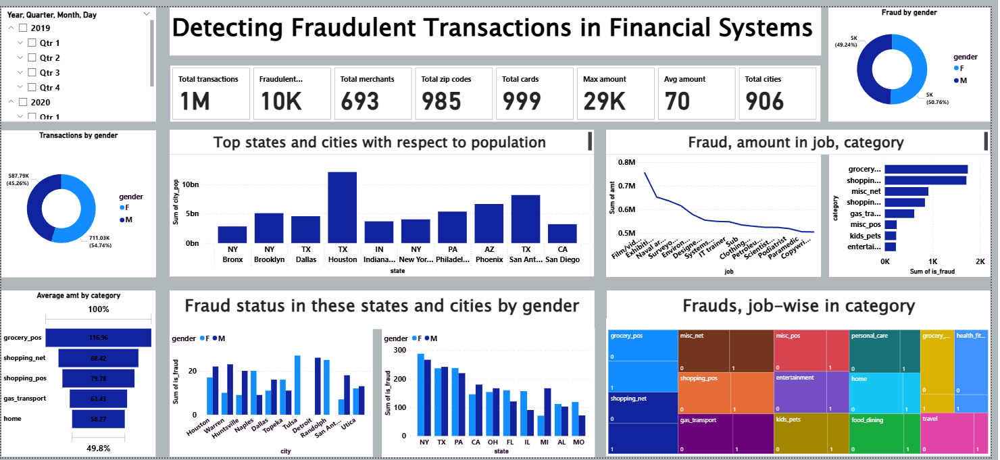

# Credit Card Fraud Detection

This repository contains the resources for a credit card fraud detection project, featuring data preprocessing using Python and a comprehensive analytical dashboard built in Power BI. The goal of this project is to analyze a large dataset of credit card transactions to identify and understand the patterns and characteristics of fraudulent activities.

## 📈 Dashboard
Link to the Power BI dashboard File: [Credit Card Fraud Dashboard](https://drive.google.com/drive/folders/1-_ppQDUqeFfby08DpfmazX2z1b2OAVnr?usp=sharing)

## 📝 Project Overview

Financial fraud poses a significant threat to institutions and consumers alike. The ability to detect fraudulent transactions quickly and accurately is crucial for minimizing losses and maintaining trust. This project leverages data analytics to transform raw transactional data into actionable insights. By using Python for data cleaning and Power BI for visualization, we've created a dashboard that provides a multi-faceted view of fraud, enabling stakeholders to explore patterns based on geography, transaction categories, gender, and more.

## 📊 Key Insights & Analysis

The dashboard reveals several key patterns and trends in fraudulent transactions:

### 📌 Key Performance Indicators (KPIs)

A high-level overview of the dataset provides context on the scale of transactions and the prevalence of fraud:
*   **Total Transactions:** 1 Million
*   **Fraudulent Transactions:** 10,000 (1% of total transactions)
*   **Average Transaction Amount:** $70
*   **Max Transaction Amount:** $29,000

The 1% fraud rate highlights a classic class imbalance problem, where fraudulent activities are rare events, making them harder to detect.

### (Fraud by Gender)

-   **Overall Transactions:** Females are more active, accounting for **54.74%** of total transactions.
-   **Fraudulent Transactions:** Despite making fewer transactions overall, males account for a slightly higher percentage of fraud at **50.76%**, compared to **49.24%** for females. This indicates that transactions made by males have a slightly higher probability of being fraudulent.

### 🌎 Geographical Fraud Analysis

Fraud is not evenly distributed geographically; certain states and cities are clear hotspots:
-   **Top States for Fraud:** **New York (NY)** has the highest number of fraudulent transactions, followed by **Texas (TX)** and **Pennsylvania (PA)**.
-   **Top Cities for Fraud:** Cities like **Detroit, Tulsa, and San Antonio** show significant fraud activity.
-   **Gender Disparity in Cities:** Across most cities with high fraud rates, fraudulent transactions committed by males are more frequent than those by females.

### 📂 Fraud by Category & Profession

Analyzing fraud by spending category and cardholder profession uncovers where fraudsters are targeting their efforts:

-   **Highest Fraud *Count* by Category:** The most frequent fraudulent transactions occur in everyday spending categories like **`grocery_pos`**, **`shopping_net`**, and **`misc_net`**. This suggests a strategy of making numerous, smaller fraudulent transactions that might go unnoticed.
-   **Highest Fraud *Amount* by Profession:** While everyday categories see high frequency, high-value fraud is linked to specific professions. Cardholders with jobs like **Film/Video Editor**, **Exhibition Designer**, and **Naval Architect** are associated with the highest total fraudulent amounts.

## 🛠️ Data Processing & Methodology

The final dashboard is built on a cleaned and transformed dataset. The data preparation was performed using Python in a Jupyter Notebook (`Creditcard_fraud.ipynb`).

1.  **Data Sourcing:** The initial data was sourced from two separate files: `fraudTrain.csv` and `fraudTest.csv`.

2.  **Data Cleaning & Feature Selection:**
    *   Several columns deemed irrelevant for this specific analysis were dropped to streamline the dataset. These included unique identifiers, timestamps, and personal details like names and dates of birth.
    *   Columns dropped: `Unnamed: 0`, `trans_date_trans_time`, `cc_num`, `merchant`, `first`, `last`, `street`, `city`, `zip`, `lat`, `long`, `dob`, `trans_num`, `unix_time`, `merch_lat`, `merch_long`.

3.  **Handling Class Imbalance:**
    *   The original training data had a significant imbalance between fraudulent and non-fraudulent transactions.
    *   To ensure that fraud patterns were adequately represented in the analysis, an oversampling technique was applied. All fraudulent transactions from `fraudTest.csv` were identified and merged with the `fraudTrain.csv` dataset. This created a more balanced dataset for visualization in Power BI.

4.  **Data Transformation (Feature Engineering):**
    *   Categorical columns were converted into numerical representations to be used effectively in the dashboard visuals.
    *   **Label Encoding:** Columns like `gender`, `category`, `state`, and `job` were manually encoded into numerical values. For example, `M` (Male) was mapped to `1` and `F` (Female) to `2`.

## 🎨 Dashboard Components

The Power BI dashboard utilizes a range of visualizations to tell a clear and compelling story:

*   **KPI Cards:** Display essential summary statistics at a glance.
*   **Donut Charts:** Effectively show the proportional distribution of transactions and fraud by gender.
*   **Bar & Column Charts:** Used for direct comparison of fraud metrics across different geographical locations and transaction categories.
*   **Line Chart:** Illustrates the trend of total fraudulent amounts across various professions.
*   **Filters:** Interactive slicers for `Year`, `Quarter`, `Month`, and `Day` allow users to drill down into specific time periods for more granular analysis.

## 💻 Tools & Technologies

*   **Data Manipulation:** **Python** with the **Pandas** library.
*   **Development Environment:** **Jupyter Notebook / Google Colab**.
*   **Data Visualization:** **Microsoft Power BI**.

## 🚀 Future Work

This project lays a strong analytical foundation. Potential future enhancements include:
*   **Predictive Modeling:** Build and deploy a machine learning model (e.g., Logistic Regression, Random Forest, or a Neural Network) to predict fraudulent transactions in real-time.
*   **Real-Time Data Pipeline:** Develop a pipeline to stream live transaction data into the dashboard for up-to-the-minute monitoring.
*   **Advanced Anomaly Detection:** Implement more sophisticated anomaly detection algorithms to identify unusual spending patterns that may indicate new types of fraud.